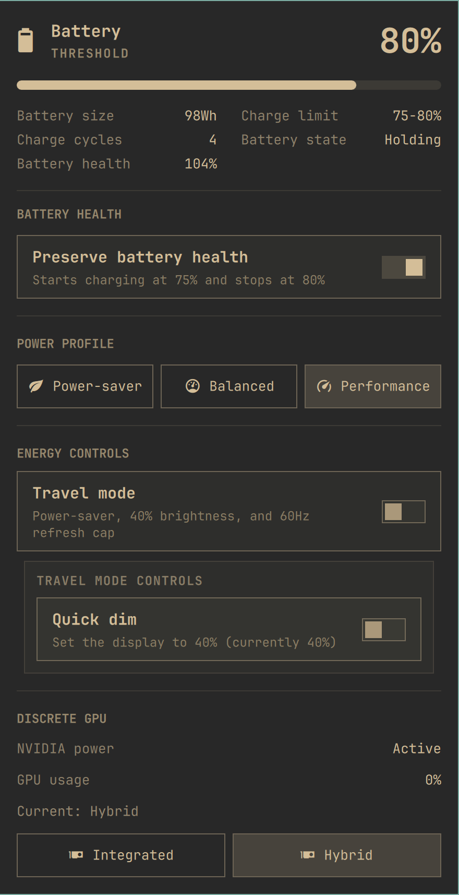

# Laptop Power Center for Omarchy

A theme-aware replacement for Omarchy's built-in laptop power widget. It
combines battery charge protection, power profiles, reversible travel controls,
display dimming, and optional NVIDIA GPU status and mode controls in one panel.



Version 1.2.1 fixes battery-protection detection on systems that retain a
nonzero resume threshold when the stop threshold is 100%. Version 1.2.0 added
optional GPU utilization/power readings and battery health, with safer polling
and clearer Travel Mode failure handling. See
[the changelog](CHANGELOG.md) for the release details. The preview is a real
ThinkPad P1 capture; unsupported readings such as GPU watts are hidden.

Unsupported controls are hidden automatically, so the panel can be used on
laptops that provide only some of these capabilities.

## Features

- Shows battery level, capacity, charge cycles, charge rate, and remaining time.
- Shows battery health (full-charge capacity relative to design capacity) when
  UPower supplies valid values; this is separate from the current charge level.
- Enables or disables firmware-backed battery charge protection through UPower.
- Switches between the power profiles available on the system.
- Provides a reversible 40% Quick Dim control.
- Provides a Travel Mode that saves the current profile, monitor, brightness,
  and display refresh rate; applies Power-saver, 40% brightness, and a 60Hz
  refresh cap; and restores the saved state when disabled.
- Reports whether an NVIDIA GPU is active, sleeping, disabled, or unavailable.
- Shows NVIDIA utilization and live power draw when the installed driver
  exposes those readings. Queries run only while the panel is open, target the
  detected NVIDIA display device, and time out after two seconds (with a
  one-second forced-termination grace period). A fresh runtime-state check skips
  sleeping GPUs, though a race with runtime suspend cannot be ruled out.
- Shows GPU mode controls only when an NVIDIA GPU and a usable `supergfxctl`
  installation report more than one supported mode.
- Uses Omarchy's standard panel, spacing, colors, buttons, confirmation dialogs,
  and keyboard navigation.

Travel Mode deliberately leaves GPU mode unchanged because a GPU transition
may require a logout or reboot and may be unsupported by the laptop firmware.
Its restore point is session-oriented and intentionally expires at reboot.
If applying or restoring Travel Mode fails, the panel shows an incomplete
change and retains the restore point. Turn Travel Mode off to retry restoring
the saved settings. Older restore points without a completion marker also
appear as incomplete. Manual changes to settings are not continuously reconciled.

## Requirements

- Omarchy with the Quickshell plugin system.
- `upower`, `busctl`, and `powerprofilesctl`, normally provided by Omarchy.
- Omarchy's `omarchy-brightness-display` command for Quick Dim. The switch is
  hidden when no controllable display is available.
- Optional: NVIDIA's `nvidia-smi` for discrete-GPU utilization and power draw.
- Optional: `supergfxctl` and a working `supergfxd` configuration for GPU modes.
- Requires `jq` to cap the display refresh rate during Travel Mode on
  Hyprland. Skipped automatically when `jq` is unavailable.

Actual feature support depends on the laptop firmware, kernel drivers, UPower,
and vendor GPU tooling.

## Install

```bash
omarchy plugin add https://github.com/cbayschm74/omarchy-laptop-power-center.git --enable
```

The manifest declares this plugin as a clone of `omarchy.power`, so enabling it
replaces the built-in power widget in place instead of adding a second battery
widget. Open the battery icon in the bar to access the panel.

## Use

Battery Health appears only when UPower reports charge-threshold support.
Energy controls appear only when their corresponding kernel or system feature
is available.

When GPU mode controls are available, selecting a reported mode sends the
request to the installed `supergfxctl` client after confirmation. The daemon
decides whether the transition can be applied and whether a logout or reboot is
required. Some laptops expose GPU selection only in firmware; on those systems,
the reported GPU state may be informational and mode changes may fail or time
out.

## Remove

```bash
omarchy plugin disable io.github.cbayschm74.laptop-power-center
omarchy plugin remove io.github.cbayschm74.laptop-power-center
```

Disabling or removing the plugin restores the built-in Omarchy power widget. It
does not change the current charge threshold, GPU mode, power profile, or other
hardware settings.

## Security and system integration

Omarchy plugins run as unsandboxed user code. Review third-party plugins before
installing them.

- Battery charge protection calls UPower's D-Bus charge-threshold method.
- GPU requests invoke the installed `supergfxctl` client with a mode it reports
  as supported.
- Brightness changes use Omarchy's installed display-brightness command.
- The bundled energy helper runs only as the current user and accepts the fixed
  operations `travel` and `quick-dim`, each with `enable` or `disable`.
- Reversible Travel Mode state is non-secret, user-owned, stored under the
  session runtime directory, and removed at reboot.
- Saved display values are type- and range-checked before constructing a
  Hyprland command. GPU telemetry and battery health use read-only queries.

## Credits and provenance

This is a derivative combined project, not a claim of sole original authorship.
It preserves and extends work from:

- [Omarchy](https://github.com/basecamp/omarchy), whose built-in power panel is
  the visual and functional base.
- [Omarchy Laptop GPU Modes](https://github.com/Minokai69/omarchy-laptop-gpu-modes)
  by Minokai-Dev, which provides the original GPU integration and Git history.
- [Battery Health for Omarchy](https://github.com/patcastle/omarchy-battery-health)
  by Patrick Castiglia, which provides the original UPower charge-threshold
  integration.
- [I. Saborit](https://github.com/iSaborit), who contributed the reversible
  Hyprland refresh-rate limiter used by Travel Mode.
- [Aaron Bird](https://github.com/artbird309), who contributed the Dell
  `50/100` charge-threshold detection fix in version 1.2.1.

See [THIRD_PARTY_NOTICES.md](THIRD_PARTY_NOTICES.md) for detailed attribution
and [LICENSE](LICENSE) for all retained MIT copyright notices.

## Development

```bash
omarchy plugin validate .
./test.sh
```

## License

MIT. See [LICENSE](LICENSE).
